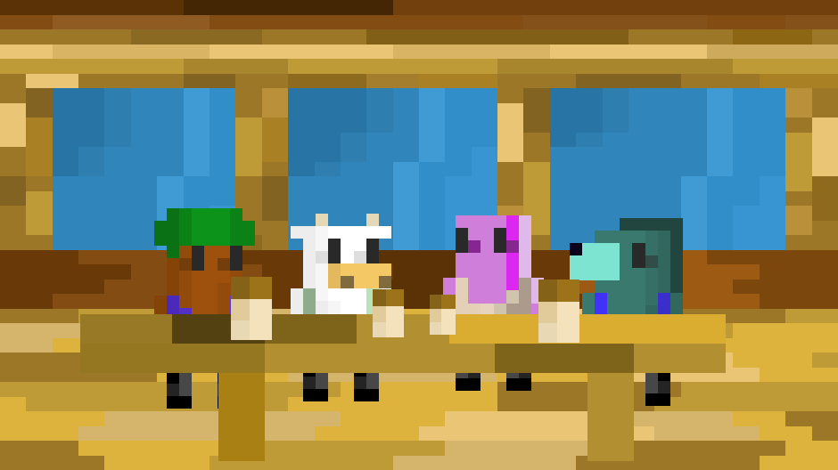

# A GitHub to figure out GitHub and make extremely well commented code

This is a repository for a simple animated cafe. Including my resume. Possible future additions might include more fun invoked games.

## What I Do
HTML, CSS, and JavaScript are the obvious web development skills. Wordpress isn't a skill, but setting up a site properly take a little practice. 

I know jQuery, but never use it because there are too many workflows, MVCs, or other things that seem more powerful.

PHP ,Ajax , and MySQL - I learned this stuff very early on, but haven't run a big scale project to practice it too much.

I've used ES2015, node, Gulp, Angular 2, React, EmberJs, Laravel, webpack, CoffeeScript, and SASS. 

## Things I Want To Learn
There are a few workflows, and frameworks I want to continue practicing. Angular 2, EmberJs, and React are very popular. So I want to continue practicing with them. 

I have tried out some programming languages: Obj-C, Python, and a little bit of Ruby and Java. I would like to learn more Python, Ruby on Rails, C++, .NET, React Redux/Flux and I would like to look into making a child theme for Wordpress.

# aSimpleCafe
